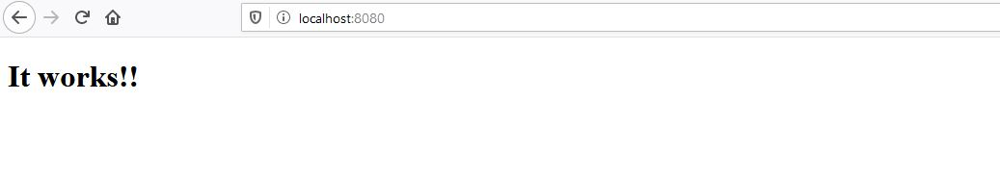
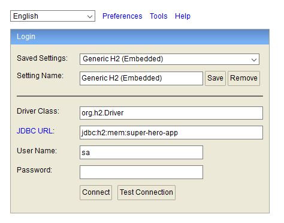
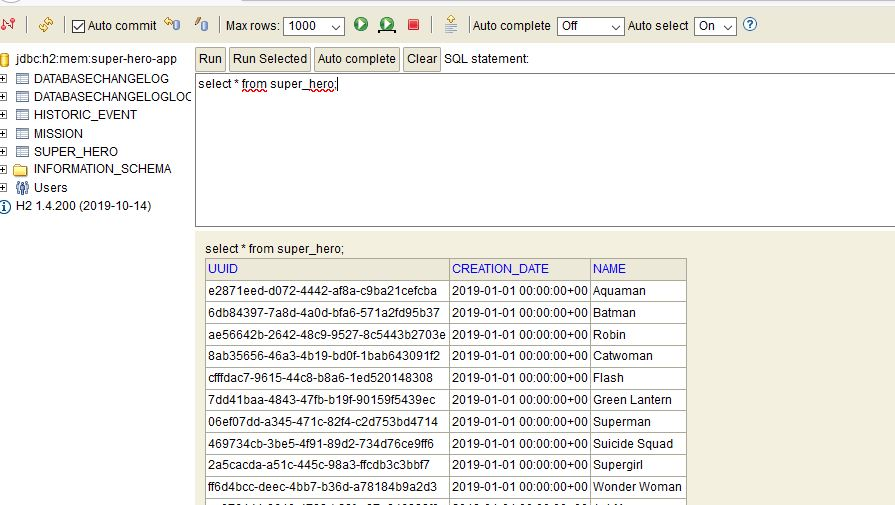
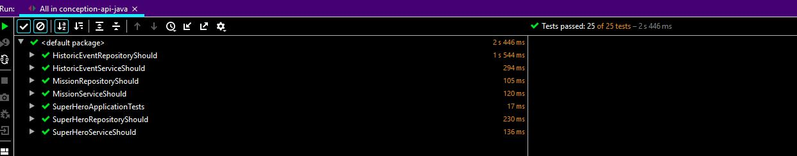
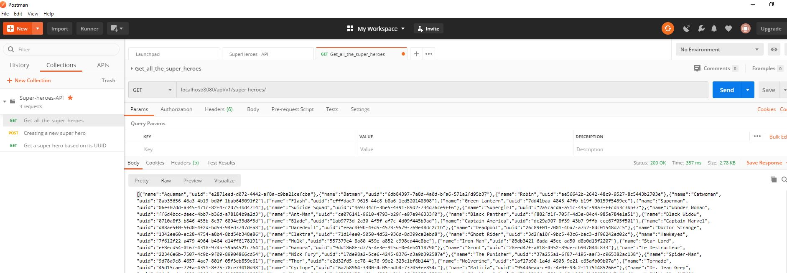

# Super hero Training Application

## Avant de commencer 
Il est essentiel de vérifier que l'existant fonctionne sur votre poste.

### Déploiement de l'application

* Depuis votre terminal, executez la commande :  

        mvn spring:boot-run

- [x] Vérifiez bien que vous lancez la commande depuis la racine du projet.

Vous devriez avoir le message ci-dessous dans le terminal:


    ... superhero.SuperHeroApplication   : Started SuperHeroApplication in 8.19 seconds (JVM running for 8.888) 


* Depuis votre navigateur, allez à l'addresse: `` http://localhost:8080/``

Vous devez avoir une page comme ci-dessous: 


### Vérification des données initiales
Au démarrage, nous initialisons la table des super héros grâce à [liquibase](https://www.liquibase.org/).

Nous utilisons [H2](https://h2database.com/html/main.html) pour la persistance ( éphémère) des données en mémoire.
* Vérifiez que les données initiales ont bien été chargées:

    * Aller à l'addresse: `` http://localhost:8080/h2-console``
    
    * Connectez-vous à la base de données: 
    
- [x] Vérifiez bien que la valeur du champ JDBC URL. Elle doit être égale à:  *jdbc:h2:mem:super-hero-app*
   
    * Lister les entrées de la table super_hero:     `` select * from super_hero``
       

- [x] Tout marche bien ? Chouette ! Tous les tests sont-ils au vert ?

### Execution des tests
 
* Depuis votre terminal, executez la commande :  

        mvn clean test

- [x] Vérifiez bien que vous lancez la commande depuis la racine du projet.

Vous devriez avoir le message ci-dessous dans le terminal:

    
    ...
    [INFO] Results:
    [INFO]
    [INFO] Tests run: 25, Failures: 0, Errors: 0, Skipped: 0
    [INFO]
    [INFO] ------------------------------------------------------------------------
    [INFO] BUILD SUCCESS
    [INFO] ------------------------------------------------------------------------
    ...
    
Si vous choisissez de lancer les tests depuis votre IDE ( clic droit > run all tests), vous verrez la barre verte \o/ 


## TP 1 : Définir vos APIs

Avec votre équipe métier, vous avez défini vos endpoints. Il vous faut désormais les implementer !

Pour rappel, vous avez défini les choix suivant :

Tout vos services seront exposé en V1 sur `/api/v1`

* `/super-heros` :
  * `GET` : Liste tous les super héros dans la base de données
  * `POST` : Créé un super héros
* `/super-heros/{uuid}`
  * `GET` : Récupère un super héros
  * `PUT` : Met à jour un super héros
* `/missions` :
  * `GET` : Liste toutes les missions
  * `POST` : Créé une nouvelle mission (une mission doit être rattaché à un super heros)
* `/missions/{uuid}`
  * `GET` : Récupére une mission
* `/missions/{uuid}/history-events`
  * `GET` : Liste l'historique des événements d'une mission
  * `POST` : Rajoute une nouvelle évènement dans l'historique d'une mission
  
## TP 2 : Implémentation des APIs 
  
Pour cette partie, nous utiliserons [Spring Web MVC](https://docs.spring.io/spring-framework/docs/3.2.x/spring-framework-reference/html/mvc.html) mais, vous pouvez utiliser [Apache CXF](http://cxf.apache.org/) 
si vous êtes plus à l'aise.
Spring Web MVC est déjà reférencée dans ce projet.

    
    <dependency>
	    <groupId>org.springframework.boot</groupId>
	    <artifactId>spring-boot-starter-web</artifactId>
	</dependency>

### Etape 1: Ajouter un provider pour Jackson 
  
  Afin de pouvoir sérialiser et désérialiser vos POJOS, vous aurez besoin d'un provider implémentant JAX-RS (JSR-331).

    <dependency>
      	<groupId>com.fasterxml.jackson.jaxrs</groupId>
       	<artifactId>jackson-jaxrs-json-provider</artifactId>
    </dependency>

Qui dit implémentation dit Tests car le Test est votre premier client/ consommateur d'API.  

### Etape 2 :Ajouter de quoi tester vos APIs !
   
Nous avons choisi restAssured pour l'implémentation des tests. Et comme nous avions opté pour du Spring MVC, 
nous pouvons directement utiliser *RestAssured pour Spring Mock MVC*.
   
    <dependency>
      	<groupId>io.rest-assured</groupId>
      	<artifactId>spring-mock-mvc</artifactId>
      	<scope>test</scope>
    </dependency>
    
### Etape 3 : Créez votre API
Créer les endpoints défini lors du TP1 dans 2 classes :
  * `SuperHeroApi`
  * `MissionApi`
    
Penser bien à annoter vos classes & vos méthodes des annotations suivantes :

* `@GetMapping`
* `@PostMapping`
* Et surtout ... `@RestController` et `@RequestMapping`  du package `org.springframework.web.bind.annotation.*`;
 
   
### Etape 4: Test driven everything ! ( Je vous accopagne)
    
Voici un petit exemple de test qui vérifie vérifie qu'une API renvoie HTTP 200 lorsque l'adresse `/api/v1//super-heroes/` est implémentée.
```java
@SpringBootTest(webEnvironment = SpringBootTest.WebEnvironment.RANDOM_PORT)
public class SuperHeroApiShould {

    @LocalServerPort
    private int port;

    protected RequestSpecification given() {
        return RestAssured.given()
                .port(port)
                .basePath("/api/v1/");
    }

   @Test
    void respond_with_a_200_status_when_getting_all_the_super_heroes_endpoint_exists() {

        this.given()
                .when()
                .get("/super-heroes/")
                .then()
                .assertThat()
                .statusCode(HttpStatus.OK.value());
    }
}
```
Le test est vert ? On peut passer en test du code de production !!! 

### Etape 5: Appelez votre API "Live"  (avec un client API) 
    
Votre test est vert? Félicitations, vous pouvez être sûrs/sûres que votre API répond.
 
#### Pour vérifier: 

Commencez par déployer votre application via spring boot: `mvn spring-boot:run`     
Puis **LE** test!
* Pour les plus pressés : ` curl localhost:8080/api/v1/super-heroes/`
 * Sinon, faire le même test avec Postman ( pour la posterité ou portabilité c'est selon :) ! 
    
 
